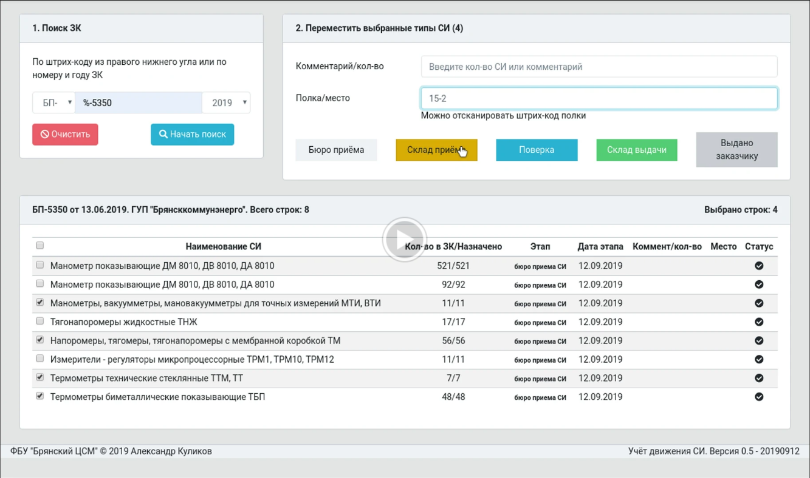

# csm-bp

Веб-приложение для БД АИС "Метрконтроль", позволяющая массово менять статус и место нахождения СИ при поверке в ЦСМ.

[](https://drive.google.com/open?id=1hVS887_XCSP5ajjmhrC41PCTloHHpnD-]

Используемые технологии:
Backend = Flask
Frontend = Vue.js (UI = CoreUI)

Перед запуском необходимо установить значения переменных окружения с настройками:
```
export MK_SERVER=<IP или DNS-имя СУБД в локальной сети>
export MK_USER=<имя пользователя>
export MK_PWD=<пароль пользователя>
export MK_DBNAME=<имя БД>
```
